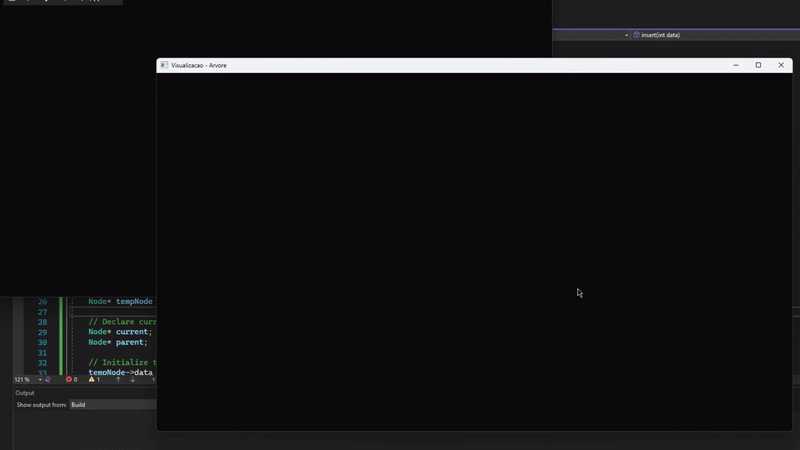

# Tree Visualization

Visualização da estrutura de dados: Árvore.

Escrita em C++, utilizando a biblioteca [Open frameworks](https://openframeworks.cc/ "Open Frameworks"). Porém sem orientação a objetos para a árvore em si, mas sim utilizando _structs_ e ponteiros. 
